# 卓の操作を、ちょい足し。

Udonarium Axe tyoitashiは、オンライン卓ツールUdonarium Axeの基本操作に、カード・チャット・画像・演出の使いやすさを足した、非公式の派生版です。

[非公式デモ](https://udonarium-trial.synwork.work/) · [公式の使い方](https://xelltis.github.io/udonarium_axe/)

デモで試せるのは固定版r5（Axe v1.57.1）です。「開発版」と書いた機能は、まだデモに入っていません。画面写真には、公開用の架空のサンプルを使っています。

## カードをまとめて扱う

**デモ（r5）で試せます**

自分の手札と全員の手札を、それぞれ一覧で見られます。カードはドラッグで人に渡したり、引いたりできます。手札を公開するときは確認が出るので、うっかり見せてしまうのを防げます。部屋ごとにできる操作を制限でき、席にいない人の手札はGMが別の人に引き継がせられます。

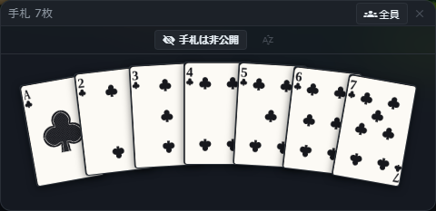

自分の手札です。公開しているかどうかと、誰から渡されたカードかが、カードの外に出ます。

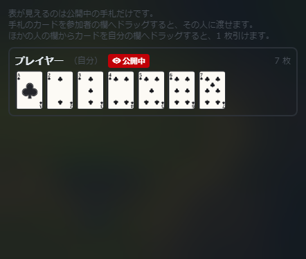

全員の手札です。公開中のカードは表、非公開のカードは裏が見えます。

## スタンプと絵文字で返す

**デモ（r5）で試せます**

短い言葉を打つと、合いそうなスタンプが候補に出ます。絵文字だけの発言は大きく表示され、どの発言にも絵文字でリアクションを付けられます。スタンプはセットにして保存でき、キャラクターの頭上にも出せます。

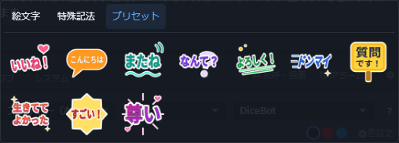

プリセット、絵文字、特殊な書き方の中から選びます。

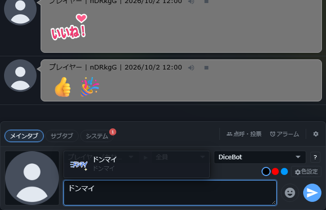

打った言葉に合うスタンプが、候補に出ます。

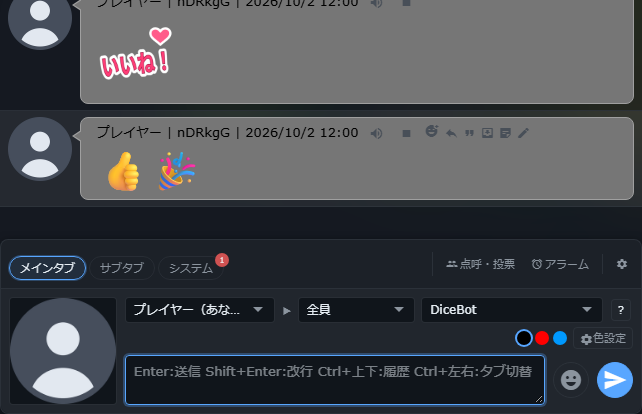

絵文字だけの発言は、大きく表示されます。

## 聞く・読み返す方法を選ぶ

**デモ（r5）で試せます**

チャットをブラウザの音声合成で読み上げられます。声の種類や速さは、自分の端末で好みに合わせられます。ログは、装飾つきのHTMLと、文字だけのテキストから選んで保存できます。自分に見えない発言（ほかの人あての秘話など）は、保存したログに入りません。

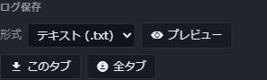

チャットタブの設定から、文字だけのログを保存します。

## 画像を貼って、背景を透かす

**デモ（r5）で試せます**

ファイルを選ぶ、ドロップする、クリップボードから貼るのどれでも、画像を追加できます。1枚だけのときは確認画面が開き、背景の色を選んで透明にできます。卓に置く画像とスタンプは、同じ画像一覧を使います。

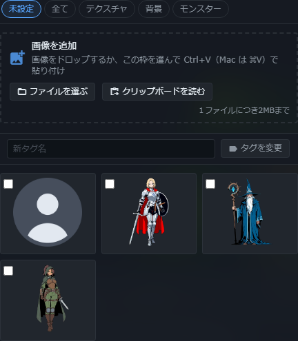

画像を追加する入口です。写真は新しい開発版の画面ですが、画像の追加はデモでも使えます。

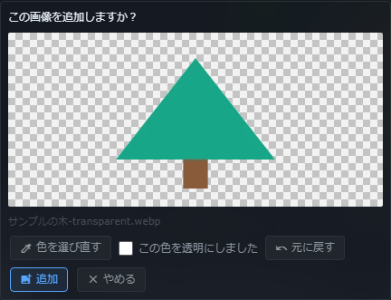

スポイトで背景の色を選び、透明になった結果を確かめます。

## キャラクターが参戦する

**デモ（r5）で試せます**

カットインに、キャラクターの画像と名前を差し込めます。立ち絵をドラッグして輪郭に合わせると、同じ輪郭を使う別の演出にも使い回せます。画像がないときは、シルエットが出ます。

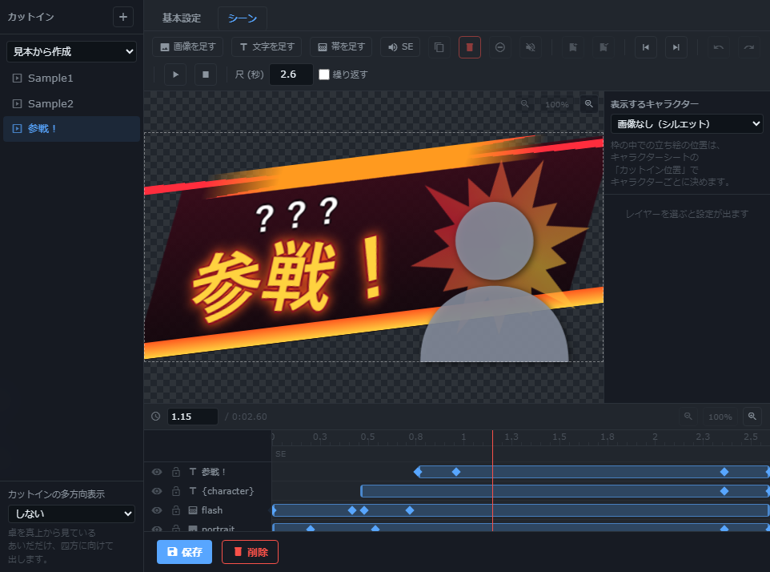

画像と文字を重ねた「参戦！」の見本です。

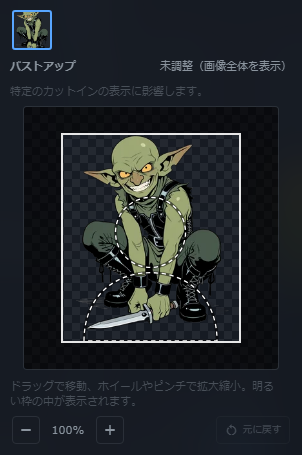

キャラクターシートから、立ち絵を輪郭に合わせます。

## 小さな反応を、さっと送る

**デモ（r5）で試せます**

絵文字、短い文字列、卓の画像を素材にした、反応用のエフェクトです。対象へぽんと出す、投げる、降らせるといった動きが短く再生されます。ホットバーにも登録できます。

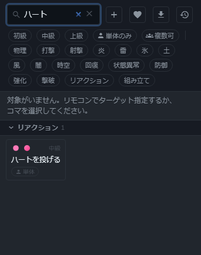

エフェクトの一覧から、反応の演出を選びます。

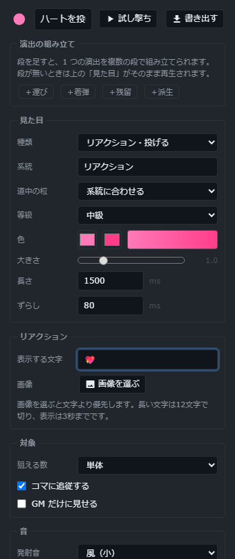

反応の素材と動きを編集します。

## 3つの見本から試す

**開発版（デモにはまだありません）**

はじめてホットバーを開くと、1D100をチャットに入力する・キャラクターシートを開く・コマへ視点を移す、の3つの見本が入っています。そのまま使っても、書き換えたり消したりしてもかまいません。いま使っているホットバーは変わりません。

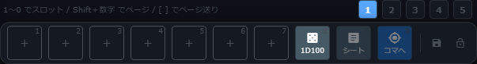

新しく使い始める人向けの、3つの見本です。

## 長い文章を読みやすく

**開発版（デモにはまだありません）**

共有メモ、キャラクターの長文、マップマスク、カードの文字を「整形」にすると、見出し・箇条書き・引用・コードを使えます。必要な欄だけ切り替えられ、`2*3` のような計算の記号はそのまま残ります。

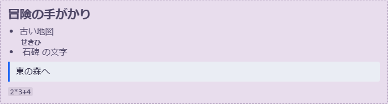

見出し、箇条書き、引用、コードとルビを整形した表示です。

## カットインを手軽に作る

**開発版（デモにはまだありません）**

文字の書式、位置とサイズ、全体の動き、見た目と効果を、それぞれ必要なときに開きます。文字ごとの細かい動きは最後にまとめ、まず読みやすい文字と配置から作れます。

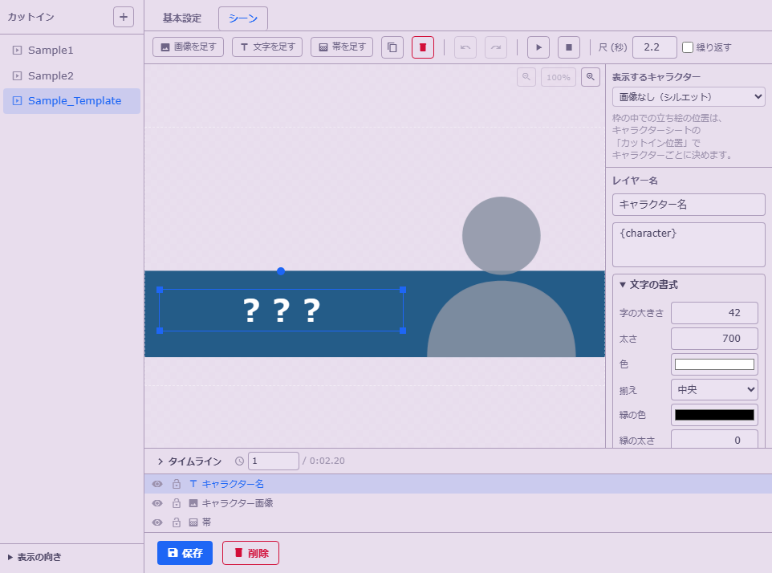

初期テンプレートの文字を編集する画面です。タイムラインは閉じたまま使えます。

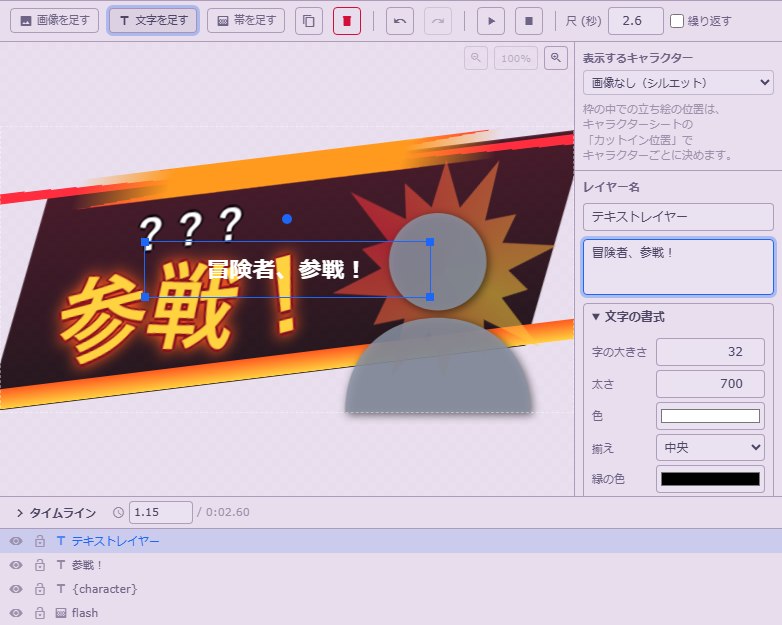

文字の書式から編集を始めます。位置や動きは別の項目で調整できます。

## 演出の見本を選ぶ

**開発版（デモにはまだありません）**

新しい卓は、Sample1・Sample2・Sample_Template から始めます。短い演出の見本16個は、アプリには入っていません。必要なときだけ、GitHubから16個入りのZIPをダウンロードして、いつもの読み込みで部屋に取り込みます。すでに保存したカットインは、そのまま残ります。

[16個入りの演出見本ZIPをダウンロード](https://github.com/synchro4351/udonarium_axe/raw/main/examples/tyoitashi-cut-ins.zip)

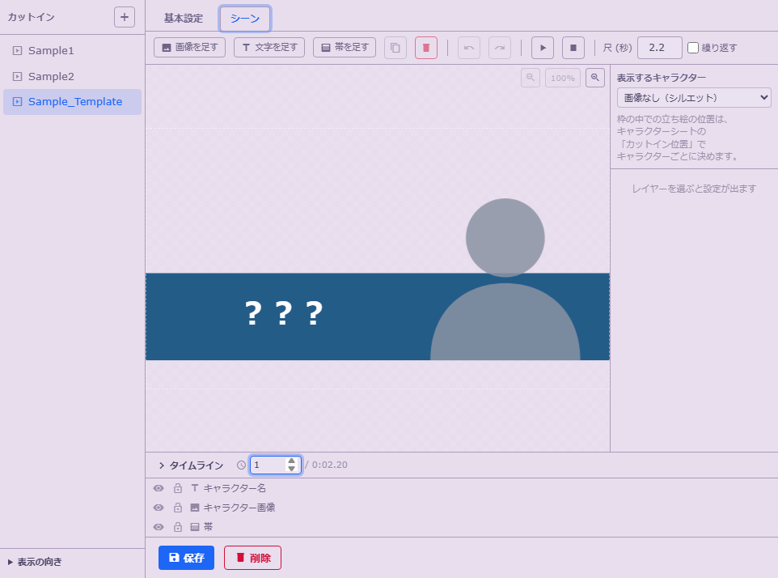

キャラクターの画像と名前を差し込むだけの、簡単なテンプレートです。

## 文字を一つずつ動かす

**開発版（デモにはまだありません）**

文章は一つのまま、文字ごとに、現れる順番・間隔・方向・傾き・退場を選べます。まず簡単な見本ボタンから始められ、細かい設定は必要なときに開きます。

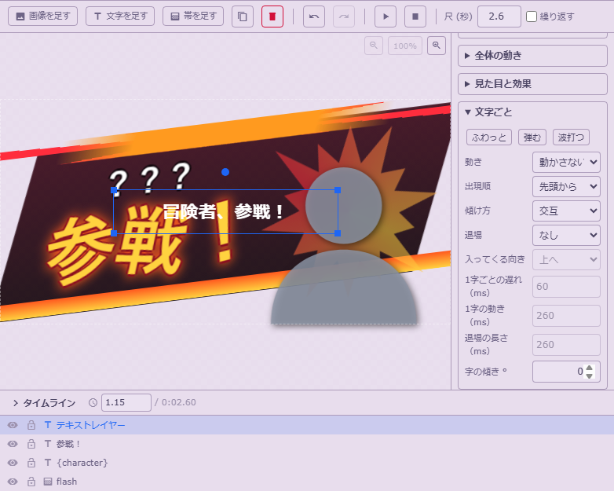

「文字ごと」を開くと、見本ボタンから動きを選べます。

## ルビを手軽に入力

**開発版（デモにはまだありません）**

`|漢字<かんじ>` と半角で打つだけで、ルビが付きます。これまでの `|漢字《かんじ》` もそのまま使えます。読み上げはふりがなで読み、HTMLログにもルビが残ります。

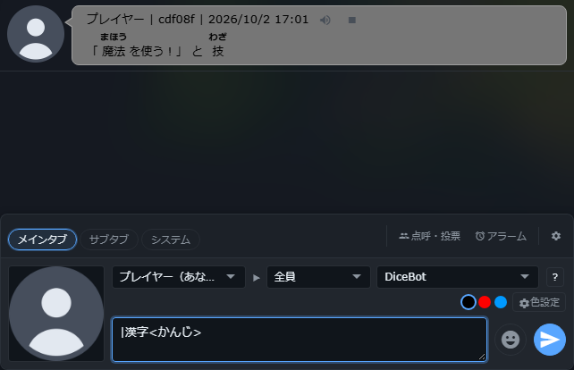

新しい書き方とこれまでの書き方を、同じチャットで使った例です。

## 一枚の絵から、部位ごとのコマ

**開発版（デモにはまだありません）**

画像をドラッグで囲み、部位ごとに名前を付けて作ります。HPや移動はコマごとに別々で、元の画像も残ります。通常の卓データとして保存できます。

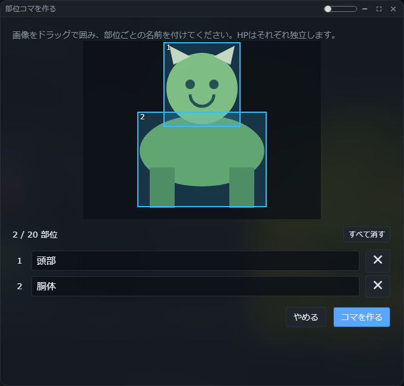

頭部と胴体を囲んで、別々のキャラクターコマにした例です。

## 素材と利用条件

画面写真は動きを止めたものです。ソースと同梱素材の条件は、リポジトリの[LICENSE](https://github.com/synchro4351/udonarium_axe/blob/main/LICENSE)を見てください。くわしい確認結果は[開発者向け資料](DEVELOPER_REFERENCE.md)にあります。
