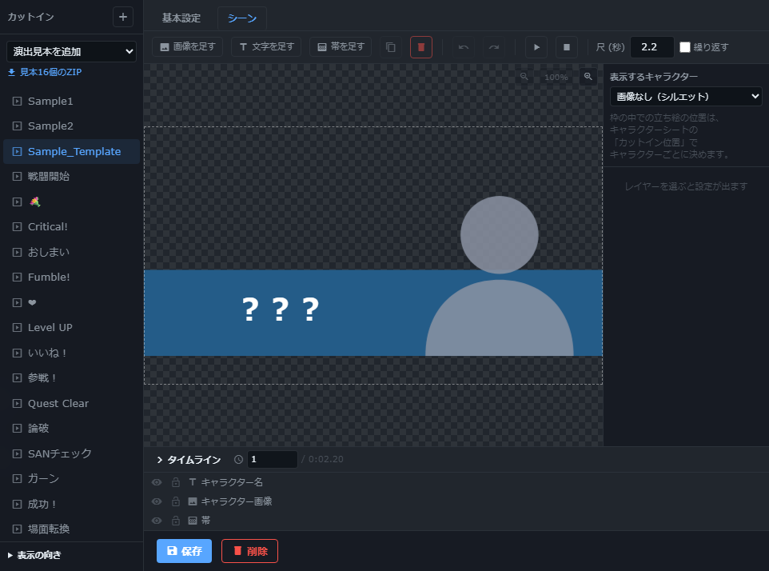

# 卓の操作を、ちょい足し。

Udonarium Axe tyoitashiは、Axeの基本操作に、カード・チャット・画像・演出の使いやすさを足した非公式フォークです。

[非公式デモ](https://udonarium-trial.synwork.work/) · [ソースと変更一覧](https://github.com/synchro4351/udonarium_axe) · [公式の使い方](https://xelltis.github.io/udonarium_axe/)

試用サイトは固定版r5（Axe v1.57.1）。「開発版」の機能はまだ試用サイトに入っていません。写真は公開用の架空サンプルを使い、機能ごとに撮影したソースを記録しています。

## カードをまとめて扱う

**r5で利用可** — 自分と全員の手札を一覧に。ドラッグで渡す・引く操作ができ、公開は確認してから行います。部屋ごとに操作を制限し、不在者の手札はGMが引き継がせられます。

自分の手札。公開状態と渡し主をカードの外に表示。 [撮影ソース 17ba32be](https://github.com/synchro4351/udonarium_axe/tree/17ba32be9c22fad3ccc313553f74aa203ae91355)

全員の手札。公開中は表面、非公開は裏面。 [撮影ソース 17ba32be](https://github.com/synchro4351/udonarium_axe/tree/17ba32be9c22fad3ccc313553f74aa203ae91355)

[機能のソース](https://github.com/synchro4351/udonarium_axe/tree/codex/card-hand-visibility-sort-provenance)

## スタンプと絵文字で返す

**r5で利用可** — 短い言葉からスタンプを候補表示。絵文字だけの発言は大きく、各発言には絵文字リアクションを付けられます。スタンプはセットで保存でき、キャラクターの頭上にも表示できます。

プリセット、絵文字、特殊記法を選ぶ。 [撮影ソース 17ba32be](https://github.com/synchro4351/udonarium_axe/tree/17ba32be9c22fad3ccc313553f74aa203ae91355)

入力した言葉に合うスタンプを候補表示。 [撮影ソース 17ba32be](https://github.com/synchro4351/udonarium_axe/tree/17ba32be9c22fad3ccc313553f74aa203ae91355)

絵文字だけの発言は大きく表示。 [撮影ソース 17ba32be](https://github.com/synchro4351/udonarium_axe/tree/17ba32be9c22fad3ccc313553f74aa203ae91355)

[機能のソース](https://github.com/synchro4351/udonarium_axe/tree/codex/chat-stamps)

## 聞く・読み返す方法を選ぶ

**r5で利用可** — ブラウザの音声合成でチャットを読み上げ、声や速度は端末ごとに設定します。ログは装飾付きHTMLと、文字だけのテキストを選んで保存できます。読めない発言は出力しません。

チャットタブ設定から文字ログを保存。 [撮影ソース 75b16b3a](https://github.com/synchro4351/udonarium_axe/tree/75b16b3a52adfe214953e9b995872b6d1096f18e)

[機能のソース](https://github.com/synchro4351/udonarium_axe/tree/codex/chat-stamps)

## 画像を貼って、背景を透かす

**r5で利用可** — ファイル、ドロップ、クリップボードから画像を追加。1枚なら確認画面で背景色を選んで透過できます。卓の画像とスタンプで共通の画像一覧を使います。

画像の入口を一つに整理した開発版の画面。 [撮影ソース 17ba32be](https://github.com/synchro4351/udonarium_axe/tree/17ba32be9c22fad3ccc313553f74aa203ae91355)

スポイトで背景色を選び、透過結果を確認。 [撮影ソース 17ba32be](https://github.com/synchro4351/udonarium_axe/tree/17ba32be9c22fad3ccc313553f74aa203ae91355)

[機能のソース](https://github.com/synchro4351/udonarium_axe/tree/codex/clipboard-media-image)

## キャラクターが参戦する

**r5で利用可** — カットインへキャラクターの画像と名前を差し込みます。立ち絵を輪郭へドラッグで合わせれば、同じ輪郭を使う演出で再利用できます。画像がない時はシルエットを表示します。

画像と文字を重ねた「参戦！」の見本。 [撮影ソース 17ba32be](https://github.com/synchro4351/udonarium_axe/tree/17ba32be9c22fad3ccc313553f74aa203ae91355)

キャラクターシートから立ち絵を輪郭に合わせる。 [撮影ソース 75b16b3a](https://github.com/synchro4351/udonarium_axe/tree/75b16b3a52adfe214953e9b995872b6d1096f18e)

[機能のソース](https://github.com/synchro4351/udonarium_axe/tree/codex/character-portrait-fit)

## 小さな反応を、さっと送る

**r5で利用可** — 絵文字、短い文字列、卓の画像を素材にするエフェクト。対象へぽんと出す、投げる、降らせる動きを短時間で再生し、ホットバーにも登録できます。

エフェクト一覧から反応演出を選ぶ。 [撮影ソース 75b16b3a](https://github.com/synchro4351/udonarium_axe/tree/75b16b3a52adfe214953e9b995872b6d1096f18e)

反応の素材と動きを編集する。 [撮影ソース 75b16b3a](https://github.com/synchro4351/udonarium_axe/tree/75b16b3a52adfe214953e9b995872b6d1096f18e)

[機能のソース](https://github.com/synchro4351/udonarium_axe/tree/codex/emoji-effects)

## 3つの見本から試す

**開発版** — 初回のホットバーに、1D100の入力、キャラクターシートの開閉、コマへの視点移動を用意。異なる用途の操作を試し、そのまま編集・削除できます。既存のバーは変更しません。

新規利用者向けの3つの見本。 [撮影ソース 17ba32be](https://github.com/synchro4351/udonarium_axe/tree/17ba32be9c22fad3ccc313553f74aa203ae91355)

[機能のソース](https://github.com/synchro4351/udonarium_axe/tree/codex/hotbar-discovery-samples)

## 長い共有メモを読みやすく

**開発版** — 必要なメモだけ「整形」にして、見出し・箇条書き・引用・コードを使います。数式のアスタリスクは文字のまま。既存のメモは通常表示を保ち、チャットはMarkdown化しません。

編集しながら見出しと箇条書きを確認。 [撮影ソース 17ba32be](https://github.com/synchro4351/udonarium_axe/tree/17ba32be9c22fad3ccc313553f74aa203ae91355)

[機能のソース](https://github.com/synchro4351/udonarium_axe/tree/codex/shared-note-formatting)

## 基本から始め、詳細へ進む

**開発版** — カットイン編集のタイムラインや変形設定は、必要な時に開きます。折り畳んでもすべてのレイヤーを選べるので、画像と文字から始めて細かな演出へ進めます。

基本操作とレイヤー一覧を残した初期画面。 [撮影ソース 34140927](https://github.com/synchro4351/udonarium_axe/tree/3414092749630e99a008273ab50a0b9f4ef0da14)

タイムラインと詳細を開いた画面。 [撮影ソース 34140927](https://github.com/synchro4351/udonarium_axe/tree/3414092749630e99a008273ab50a0b9f4ef0da14)

[機能のソース](https://github.com/synchro4351/udonarium_axe/tree/codex/cutin-ui-disclosure)

## テンプレートと素材集を分ける

**開発版** — 新しい卓はSample1・Sample2・Sample_Templateから。短い演出見本は必要なものだけ追加するか、16個の素材ZIPを通常の読み込みで取り込めます。

キャラクター画像と名前を差し込む簡単なテンプレート。 [撮影ソース 75b16b3a](https://github.com/synchro4351/udonarium_axe/tree/75b16b3a52adfe214953e9b995872b6d1096f18e)

追加で読み込む演出見本の素材集。 [撮影ソース 75b16b3a](https://github.com/synchro4351/udonarium_axe/tree/75b16b3a52adfe214953e9b995872b6d1096f18e)

[機能のソース](https://github.com/synchro4351/udonarium_axe/tree/codex/cutin-sample-library)

## 一つの文字列に、字ごとの動き

**開発版** — 文章は一つのまま、字が現れる順番・間隔・方向・傾き・退場を選べます。簡単な見本ボタンから始め、細かな設定は必要な時に開きます。

中央から出現し、上へ退場する設定の例。 [撮影ソース 26b6eb5b](https://github.com/synchro4351/udonarium_axe/tree/26b6eb5b84ab713de02a2bf2e00903b8aa94d684)

[機能のソース](https://github.com/synchro4351/udonarium_axe/tree/codex/cutin-letter-animation-controls)

## ルビを半角で入力

**開発版** — |漢字<かんじ> と半角で入力できます。従来表記も残し、読み上げ・ログ・吹き出しでの読み方を揃えます。

新旧の記法を同じチャットで使った例。 [撮影ソース cebe7468](https://github.com/synchro4351/udonarium_axe/tree/cebe74686438b29ee4a3eb2d927621963d22154d)

[機能のソース](https://github.com/synchro4351/udonarium_axe/tree/codex/ascii-ruby)

## 一枚の絵から、部位ごとのコマ

**開発版** — 画像をドラッグで囲み、部位ごとの名前を付けて作成します。HPや移動は各コマで独立し、元画像も残ります。通常の卓データとして保存できます。

頭部と胴体を囲み、別々のキャラクターコマにする例。 [撮影ソース 70fbd8b1](https://github.com/synchro4351/udonarium_axe/tree/70fbd8b1028be73806b83a367d0f7a7caf259176)

[機能のソース](https://github.com/synchro4351/udonarium_axe/tree/codex/multipart-character-tokens)

## 素材と利用条件

画面は本フォークと公式Axeの公開サンプル、独自の検証素材で撮影しています。実卓・参加者の私的情報や、持ち込みの第三者スタンプ素材は含めていません。ソースと同梱素材の条件はリポジトリのLICENSEを参照してください。絵文字の形は端末のフォントで変わります。 [LICENSE](https://github.com/synchro4351/udonarium_axe/blob/main/LICENSE)。

スクリーンショットは動きを静止した紹介です。操作・保存・同期の検証結果は[変更一覧](https://github.com/synchro4351/udonarium_axe/blob/main/TYOITASHI_CHANGES.md)と各機能文書を参照してください。
